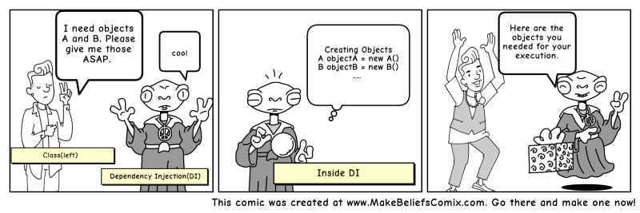

# Dependency injection
Dependency injection example app made with Flutter! This example app and the provided images try to explain the problem and the solution of dependencies in the code. The information in these images is my understanding of the topic and some from various sources on the internet about dependency injection and the other correlated topics.
 
## Let's start

